# A list of my must-haves VS Code extensions!

****************************************************************

⌾ [Beautify](https://marketplace.visualstudio.com/items?itemName=HookyQR.beautify)

⌾ Description: Beautify code in place for VS Code

****************************************************************

⌾ [Bookmarks](https://marketplace.visualstudio.com/items?itemName=alefragnani.Bookmarks)

⌾ Description: Mark lines and jump to them

****************************************************************

⌾ [Bracket Pair Colorizer 2](https://marketplace.visualstudio.com/items?itemName=CoenraadS.bracket-pair-colorizer-2)

⌾ Description: A customizable extension for colorizing matching brackets

****************************************************************

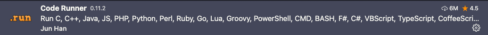

⌾ [Code Runner](https://marketplace.visualstudio.com/items?itemName=formulahendry.code-runner)

⌾ Description: Run C, C++, Java, JS, PHP, Python, Perl, Ruby, Go, etc….

****************************************************************

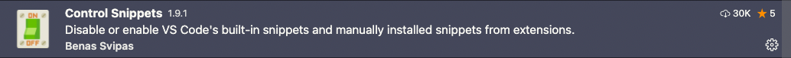

⌾ [Control Snippets](https://marketplace.visualstudio.com/items?itemName=svipas.control-snippets)

⌾ Description: Disable or enable VS Code&#39;s built-in snippets and manually installed snippets from extensions.

****************************************************************

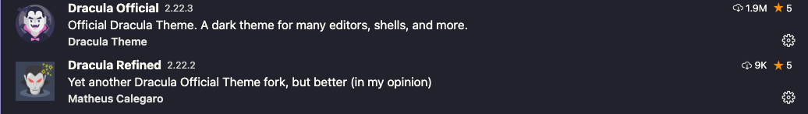

⌾ Name: Dracula Themes

****************************************************************

⌾ [endwise](https://marketplace.visualstudio.com/items?itemName=kaiwood.endwise)

⌾ Description: Wisely add &quot;end&quot; in Ruby.

****************************************************************

⌾ [GitLens — Git supercharged](https://marketplace.visualstudio.com/items?itemName=eamodio.gitlens)

⌾ Description: Supercharge the Git capabilities built into Visual Studio Code

****************************************************************

⌾ [HTML Preview](https://marketplace.visualstudio.com/items?itemName=george-alisson.html-preview-vscode)

⌾ Description: Provides ability to preview HTML documents.

****************************************************************

⌾ [HTML Snippets](https://marketplace.visualstudio.com/items?itemName=abusaidm.html-snippets)

⌾ Description: Full HTML tags including HTML5 Snippets

****************************************************************

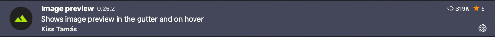

⌾ [Image preview](https://marketplace.visualstudio.com/items?itemName=kisstkondoros.vscode-gutter-preview)

⌾ Description: Shows image preview in the gutter and on hover

****************************************************************

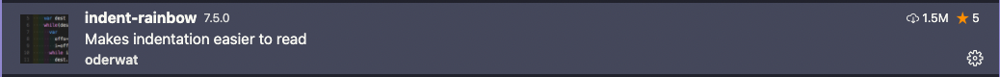

⌾ [indent-rainbow](https://marketplace.visualstudio.com/items?itemName=oderwat.indent-rainbow)

⌾ Description: Makes indentation easier to read

****************************************************************

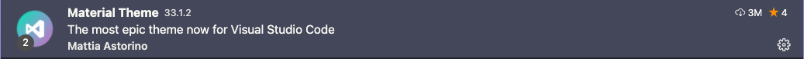

⌾ Name: Material Theme

****************************************************************

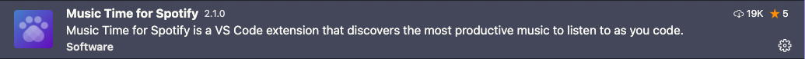

⌾ [Music Time for Spotify](https://marketplace.visualstudio.com/items?itemName=softwaredotcom.music-time)

⌾ Description: Music Time for Spotify is a VS Code extension that discovers the most productive music to listen to as you code.

****************************************************************

⌾ [Peacock](https://marketplace.visualstudio.com/items?itemName=johnpapa.vscode-peacock)

⌾ Description: Subtly change the workspace color of your workspace. Ideal when you have multiple VS Code instances and you want to quickly identify which is which.

****************************************************************

⌾ [Prettier - Code formatter](https://marketplace.visualstudio.com/items?itemName=esbenp.prettier-vscode)

⌾ Description: Code formatter using prettier

****************************************************************

⌾ [PrintCode](https://marketplace.visualstudio.com/items?itemName=nobuhito.printcode)

⌾ Description: Added printing function to VS Code which allows to save as PDF

****************************************************************

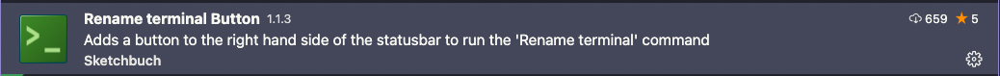

⌾ [Rename terminal Button](https://marketplace.visualstudio.com/items?itemName=sketchbuch.vsc-rename-terminal-button)

⌾ Description: Adds a button to the right hand side of the statusbar to run the &#39;Rename terminal&#39; command

****************************************************************

⌾ [Ruby Solargraph](https://marketplace.visualstudio.com/items?itemName=castwide.solargraph)

⌾ Description: A Ruby language server featuring code completion, intellisense, and inline documentation

****************************************************************

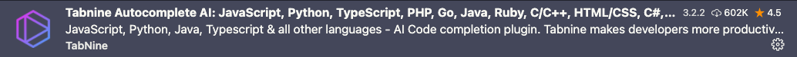

⌾ [Tabnine Autocomplete AI](https://marketplace.visualstudio.com/items?itemName=TabNine.tabnine-vscode)

⌾ Description: JavaScript, Python, Java, Typescript &amp; all other languages - AI Code completion plugin. Tabnine makes developers more productive by auto-completing their code.

****************************************************************

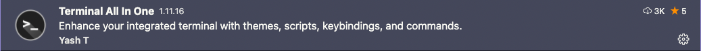

⌾ [Terminal All In One](https://marketplace.visualstudio.com/items?itemName=yasht.terminal-all-in-one)

⌾ Description: Enhance your integrated terminal with themes, scripts, keybindings, and commands.

****************************************************************

⌾ [VSCode Ruby](https://marketplace.visualstudio.com/items?itemName=wingrunr21.vscode-ruby)

⌾ Description: Syntax highlighting, snippet, and language configuration support for Ruby

****************************************************************

⌾ [WakaTime](https://marketplace.visualstudio.com/items?itemName=WakaTime.vscode-wakatime)

⌾ Description: Metrics, insights, and time tracking automatically generated from your programming activity.

****************************************************************

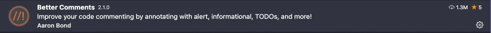

⌾ [Better Comments](https://marketplace.visualstudio.com/items?itemName=aaron-bond.better-comments)

⌾ Description: Improve your code commenting by annotating with alert, informational, TODOs, and more!

****************************************************************